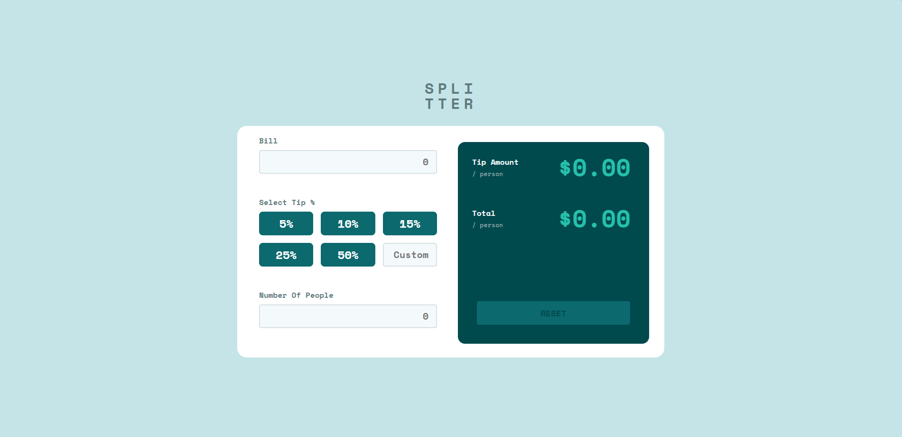
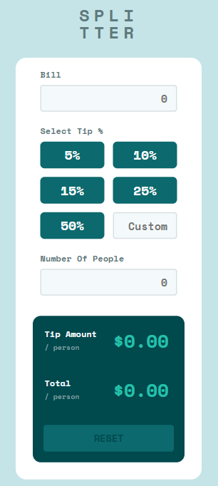

# 💸 Tip Calculator App

A responsive **React application** for calculating tips per person.  
Built with clean component-based architecture and modern CSS.

---

## ✨ Features

- Enter bill amount and number of people.
- Select predefined tip percentages (5%, 10%, 15%, 25%, 50%).
- Custom tip percentage input.
- Displays tip amount **per person** and total **per person**.
- **Error handling** (e.g. "Can't be zero" for number of people).
- **Responsive design** – works perfectly on desktop and mobile.
- Reset button to clear all inputs.

---

## 🖼️ Screenshots

### Desktop



### Mobile



---

## 🚀 Demo

🔗 [Live Demo on Vercel](https://tip-calculator-one-dun.vercel.app/)

---

## 🛠️ Tech Stack

- **React** (with hooks)
- **CSS Grid & Flexbox** for layout
- **Responsive design** with media queries

---

## ⚡ How to Run Locally

```bash
# Clone repository
git clone https://github.com/Shin778/tip-calculator.git

# Go to project folder
cd tip-calculator

# Install dependencies
npm install

# Start development server
npm run dev
```
